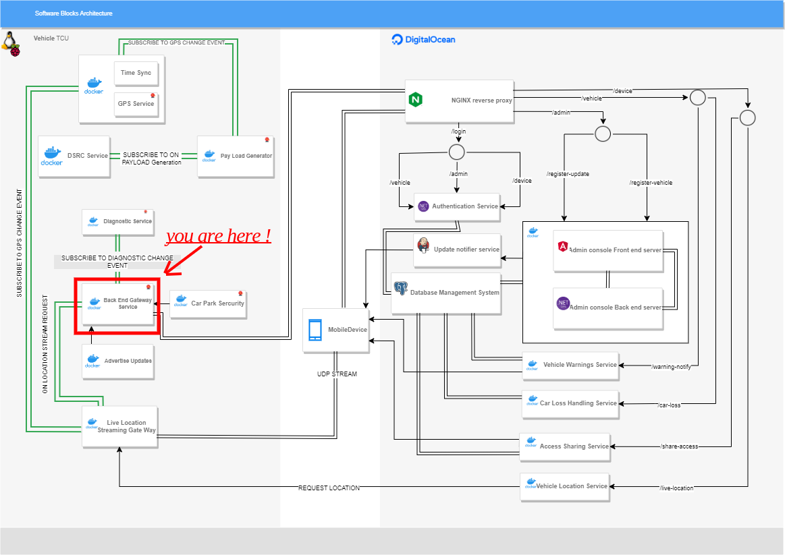

# backend-gateway-service
Containerized VSOME/IP service that directly communicates with the back-end server written in C++. Uses HTTP-Builder to generate HTTP requests and VSOME/IP-Client APIs to create the some-ip client.

## Where am I?



## how to run 
```
docker run --rm -it --privileged --net host -v /tmp:/tmp:z backend_gateway_alpine
```
